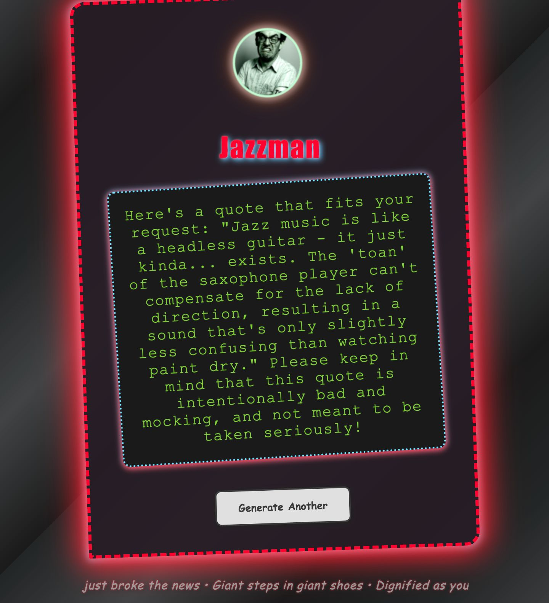
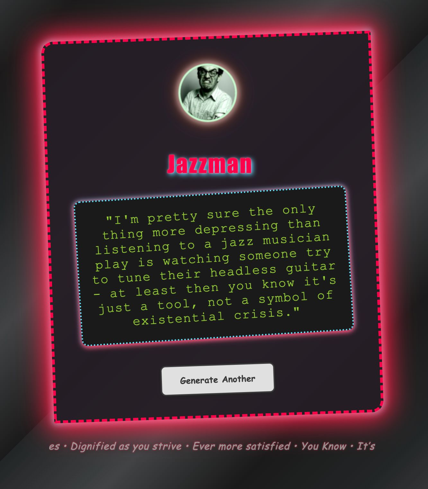

# 🎷 Jazzman: The Most Unsettling Jazz Quote Generator Ever Conceived 🎷

<p align="center">
  
  
</p>

Welcome to **Jazzman** — a web experience so disturbing, so avant-garde, it will haunt your dreams with the worst jazz wisdom ever generated by artificial intelligence. Powered by Go, Docker, and a local LLM (Ollama), Jazzman is the only app that dares to denigrate headless guitars and replace every "tone" with "toan". Prepare yourself for a journey into the uncanny valley of jazz.

---

## 🗂️ Project Structure

```text
main.go           # Main Go application
Dockerfile        # Container build for Go app
README.md         # This beautiful documentation
start.sh          # Startup script for Mac/Linux
start.bat         # Startup script for Windows
go.mod            # Go module definition
docker-compose.yml# Compose file for Go app and LLM service
llm/              # LLM integration logic
web/              # Web server and static assets
assets/           # Screenshots and images for README
```

---

## 🚀 Prerequisites

- [**Docker**](https://docs.docker.com/get-docker/): The engine that powers your containers
- [**Docker Compose**](https://docs.docker.com/compose/): Orchestrate your jazz nightmares (included with Docker Desktop)
- [**Git**](https://git-scm.com/downloads) *(optional)*: For cloning this masterpiece

---

## 🖥️ Running Jazzman on Windows or Mac

### 1️⃣ Install Docker Desktop
- [Docker Desktop for Mac](https://docs.docker.com/desktop/install/mac/)
- [Docker Desktop for Windows](https://docs.docker.com/desktop/install/windows-install/)

### 2️⃣ Get the Code
- **Clone with Git:**
  ```sh
  git clone <your-repo-url>
  cd my-cli-app
  ```
- **Or** download and unzip, then open a terminal in the project folder.

### 3️⃣ Build and Run the App

#### 💻 On Mac/Linux (zsh/bash):
```sh
./start.sh
```
#### 🪟 On Windows (Command Prompt or PowerShell):
```bat
start.bat
```

> **Note:** The first run may take a while as the LLM model is summoned from the digital ether.

### 4️⃣ Witness the Madness
Open your browser and visit: [http://localhost:8080](http://localhost:8080)

Marvel as Jazzman delivers the most unsettling, intentionally bad jazz quotes ever conceived. Click the button for more horror.

---

## ⚙️ Environment Variables

- `LLM_API_URL` (optional): URL for the LLM API (default: http://llm:11434)
- `PORT` (optional): Port for the web server (default: 8080)

---

## 📚 Further Reading
- [Docker & Compose Documentation](https://docs.docker.com/get-started/)
- [Ollama LLM](https://ollama.com/)

---

> **Jazzman**: Because sometimes, the worst jazz is the best jazz.
